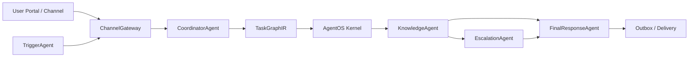

# AgentOS 소개 자료

## 한 줄 소개

AgentOS는 여러 AI 에이전트를 하나의 서비스처럼 안정적으로 실행하기 위한 범용 실행 계층입니다.  
현재 Hobit AX에서는 학사 규정 RAG, 사용자 맞춤 컨텍스트, 마감 알림, 검토 요청, 답변 전달을 AgentOS 위에서 실행하는 형태로 구현되어 있습니다.

## 왜 필요한가

일반적인 AI 서비스는 “질문을 보내고 답변을 받는 API”에서 시작하지만, 실제 서비스가 되려면 더 많은 실행 관리가 필요합니다.

- 어떤 에이전트가 어떤 순서로 실행되는지 추적해야 합니다.
- 중간 작업이 실패하거나 오래 걸릴 때 복구할 수 있어야 합니다.
- 사용자별 세션, 프로필, 과거 대화, 미리 준비된 답변을 관리해야 합니다.
- 마감일이나 규정 변경처럼 사용자가 먼저 묻지 않아도 알려줘야 하는 이벤트가 필요합니다.
- 운영자는 현재 어떤 job/run/agent가 돌고 있는지 볼 수 있어야 합니다.

AgentOS는 이 실행 관리 영역을 담당하고, Hobit AX는 학사 규정 도메인 로직을 담당합니다.

## 현재 구조



## 구현된 주요 에이전트

| 구성요소 | 역할 |
|---|---|
| `ChannelGateway` | Web, API, Portal, KakaoTalk 등 채널 payload를 공통 메시지로 정규화 |
| `CoordinatorAgent` | 메시지 분류, 실행 graph 생성, coordination plan 저장 |
| `KnowledgeAgent` | 기존 `regulation_rag` Supervisor를 호출해 규정 기반 답변 생성 |
| `PersonaWorker` | 사용자 세션 기반 예상 질문과 persona context 생성 |
| `TriggerAgent` | deadline watch, 규정 변경 이벤트 등 proactive 알림 생성 |
| `EscalationAgent` | 사람이 확인해야 하는 케이스를 review queue에 저장 |
| `FinalResponseAgent` | 최종 사용자 응답과 delivery payload 구성 |

`ActionAgent`는 Contract Studio 통합 트랙으로 분리되어 있으며, 현재 기본 실행 graph에서는 제외되어 있습니다.

## 현재 구현된 기능

### 1. AgentOS 실행 경로

- AgentOS kernel 연동
- `TaskGraphIR` 기반 graph 제출
- agent별 task lease / result report
- conditional DAG 실행
- capability manifest 등록
- agent output schema 검증
- coordination plan과 실제 lease 검증
- run lifecycle event 기록

### 2. 안정적인 실행 관리

- async job submit / polling
- worker loop
- stale `RUNNING` job requeue
- failed/cancelled job retry
- run retry / run cancel
- timeout 처리
- idempotency key 기반 중복 요청 방지
- JSONL file lock 기반 단일 머신 동시 write 보호

### 3. 세션과 사용자 컨텍스트

- conversation turn 저장
- persona snapshot 저장
- user profile 저장 및 자동 주입
- session summary / timeline / export
- prepared answer를 outbox에 저장

### 4. Proactive 알림

- deadline watch 등록
- due deadline event 생성
- due event를 AgentOS run으로 dispatch
- regulation manifest hash diff 기반 규정 변경 감지
- 변경된 규정과 관련된 watch 사용자에게 trigger event 발행

### 5. 운영/진단 기능

- `/doctor`: AgentOS kernel, 로컬 path/import/storage 상태 확인
- `/integration/probe`: kernel + regulation_rag 실제 연동 점검
- `/smoke/e2e`: graph preview부터 outbox render까지 end-to-end smoke 검증
- `/metrics/summary`: backlog 및 상태별 count
- `/alerts`: 오래 걸리는 job/run, pending delivery, open escalation, deadline due 알림
- `/runs/{run_id}/trace`: run, plan, persona, worker results, lifecycle events, outbox, escalation join

## 사용자용 화면과 운영자용 화면

현재 UI는 두 개로 분리되어 있습니다.

| 화면 | URL | 목적 |
|---|---|---|
| User Portal | `/portal` | 실제 사용자가 보는 서비스 화면 |
| Admin Console | `/app` | 운영자/개발자가 실행 상태를 보는 콘솔 |

### User Portal에서 보이는 것

- 학사 규정 질문 채팅
- TriggerAgent 마감 알림 카드
- 알림에서 바로 답변 준비 실행
- 에이전트가 미리 만들어둔 prepared answer
- PersonaWorker 기반 예상 질문
- deadline watch 등록

### Admin Console에서 보이는 것

- 채팅 submit 및 async job polling
- session timeline
- recent runs
- run lifecycle trace
- Doctor status

## 시연 흐름

1. AgentOS kernel 실행

```powershell
cd C:\Users\SEONGMIN\Documents\Workspace\Projects\agent-os
cargo run --manifest-path rust\kernel\Cargo.toml
```

2. Hobit AX AgentOS API 실행

```powershell
cd C:\Users\SEONGMIN\Documents\Workspace\Projects\hobit-ax-agentos
$env:PYTHONPATH="src"
python -m uvicorn hobit_ax_agentos.api.main:app --host 127.0.0.1 --port 8791
```

3. 사용자 포털 열기

[http://127.0.0.1:8791/portal](http://127.0.0.1:8791/portal)

4. 시연 포인트

- 질문 입력 후 답변 생성
- deadline watch 등록
- TriggerAgent 알림 카드 확인
- 알림에서 “답변 준비” 실행
- prepared answer에 답변이 쌓이는 것 확인

5. 운영 콘솔 열기

[http://127.0.0.1:8791/app](http://127.0.0.1:8791/app)

- run trace 확인
- session timeline 확인
- Doctor로 kernel 상태 확인

## 현재 검증 상태

현재 자동 테스트는 다음 범위를 포함합니다.

- 정상 지식 응답 경로
- human review escalation 경로
- agent output contract validation
- coordination plan validation
- rogue lease 실패 기록
- lifecycle trace events
- async job submit/result/error/retry/cancel
- stale running job requeue
- idempotent run reuse
- trigger deadline watch / regulation change event
- outbox 저장/렌더/dispatch
- user portal/admin UI asset serving
- doctor/readiness/integration probe/e2e smoke

검증 명령:

```powershell
python -m compileall -q .\src .\tests
pytest -q
```

현재 결과:

```text
127 passed
```

## 현재 한계와 다음 단계

현재 구현은 로컬/단일 머신 프로토타입을 안정화한 상태입니다. 실제 운영 단계에서는 다음을 추가로 고려해야 합니다.

- JSONL storage를 DB/queue backend로 전환
- long-running worker의 별도 supervisor 구성
- 실서비스 인증/권한 모델 강화
- `/portal` UX 고도화
- ActionAgent와 Contract Studio 통합
- 규정 변경 이벤트의 사용자 타임라인 범위 확장

## 핵심 메시지

AgentOS는 “LLM 답변 API”가 아니라, 여러 AI 에이전트를 실제 서비스처럼 실행하고 관찰하고 복구하기 위한 실행 운영 계층입니다.  
Hobit AX는 그 위에서 학사 규정 상담, 사용자 맞춤 context, proactive 알림, human review, prepared answer까지 포함하는 멀티에이전트 서비스를 구현하고 있습니다.
