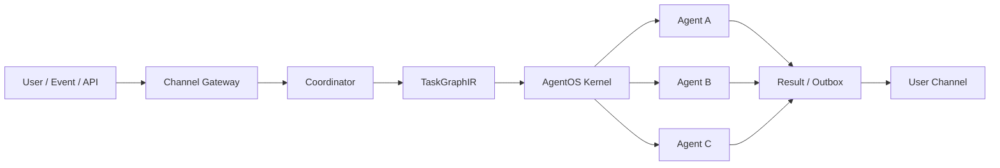
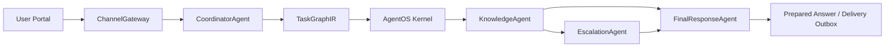
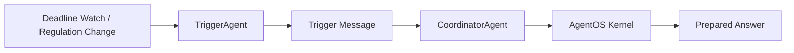

# AgentOS 소개 및 Hobit Multi-Agent Use Case

## 1. AgentOS란?

AgentOS는 여러 AI 에이전트를 하나의 안정적인 서비스처럼 실행하기 위한 **범용 에이전트 실행 운영 계층**입니다.

LLM이나 RAG 모델 자체를 대체하는 것이 아니라, 여러 에이전트가 함께 일할 때 필요한 실행 순서, 상태 관리, 실패 복구, 정책 검증, 추적, 운영 관찰을 담당합니다.

짧게 말하면:

> AgentOS는 AI 에이전트들을 “그냥 함수 호출”이 아니라, 실제 서비스 프로세스처럼 실행하고 관리하기 위한 runtime/control plane입니다.

## 2. 왜 필요한가?

단일 챗봇 수준에서는 “질문 → 답변” API만 있어도 동작합니다.  
하지만 실제 서비스에서는 다음 문제가 생깁니다.

- 어떤 에이전트가 어떤 순서로 실행되어야 하는가?
- 일부 에이전트만 실행되거나 조건부로 건너뛰어야 할 때 어떻게 관리할 것인가?
- 에이전트 출력이 약속된 schema를 지키는지 어떻게 확인할 것인가?
- 실행 중 실패, timeout, 중복 요청, 오래 걸리는 작업을 어떻게 복구할 것인가?
- 사람이 확인해야 하는 작업은 어떻게 escalation할 것인가?
- 운영자가 현재 실행 중인 run/job/agent 상태를 어떻게 볼 것인가?
- 사용자가 먼저 묻지 않아도 trigger 기반으로 알림을 보내려면 어떻게 할 것인가?

AgentOS는 이런 문제들을 개별 서비스마다 매번 새로 만들지 않도록 공통 실행 계층으로 제공합니다.

## 3. AgentOS의 핵심 개념

### TaskGraphIR

에이전트 실행 계획을 graph로 표현합니다.

예:

```text
knowledge_query
  -> escalation_prepare   if requires_human_review == true
  -> final_response
```

각 node는 어떤 agent가 실행할지, 어떤 schema를 출력해야 하는지, 어떤 조건에서 다음 node로 넘어갈지를 포함합니다.

### Kernel

AgentOS kernel은 graph를 받아 실행 상태를 관리합니다.

- graph submit
- task lease
- result report
- run state 관리
- trace/policy/audit 기반 확장

서비스 입장에서는 kernel이 “작업 스케줄러이자 실행 상태 관리자” 역할을 합니다.

### Agent Runtime

각 agent는 kernel로부터 작업을 lease받아 실행하고 결과를 report합니다.

에이전트는 서로 직접 호출하기보다, AgentOS graph와 kernel을 통해 느슨하게 연결됩니다.  
이 구조 덕분에 agent를 교체하거나 추가해도 전체 실행 구조를 추적하기 쉬워집니다.

### Capability

각 agent가 어떤 일을 할 수 있는지 선언합니다.

- agent id
- capability id
- role
- output schema
- trust tier

이를 통해 “어떤 agent가 어떤 node를 실행할 수 있는지”를 명확히 관리할 수 있습니다.

### Contract Validation

agent가 반환한 결과가 선언한 output schema와 맞는지 검증합니다.  
schema를 어기면 run을 실패로 기록하고, 운영자가 원인을 볼 수 있게 합니다.

### Plan Validation

Coordinator가 만든 실행 계획과 실제 kernel lease가 일치하는지 확인합니다.

예를 들어 계획에 없는 node가 실행되거나, skip된 agent가 실행되면 run을 실패로 처리합니다.

### Lifecycle Trace

각 run과 node의 실행 흐름을 event로 남깁니다.

예:

```text
run.started
node.leased
node.started
node.completed
node.failed
run.finished
run.timed_out
```

운영자는 이를 통해 특정 요청이 어디서 멈췄는지, 어떤 agent가 실패했는지 확인할 수 있습니다.

## 4. AgentOS가 제공하려는 가치

### 1. 에이전트 실행의 표준화

모든 에이전트를 임의의 함수 호출이 아니라 graph node로 다룹니다.  
실행 순서, 조건, 결과 schema가 명확해집니다.

### 2. 운영 가능한 AI 서비스

AI agent를 운영 환경에서 다루려면 retry, timeout, trace, audit, status API가 필요합니다.  
AgentOS는 이 운영 계층을 공통화합니다.

### 3. 멀티에이전트 확장성

새 agent를 추가할 때 전체 서비스를 다시 짜지 않고, graph와 capability를 확장하는 방식으로 붙일 수 있습니다.

### 4. 실패와 예외를 숨기지 않음

LLM 기반 서비스는 실패가 모호해지기 쉽습니다.  
AgentOS는 실패 node, 실패 agent, error type, lifecycle event를 기록해 문제를 추적할 수 있게 합니다.

### 5. 서비스와 도메인 로직의 분리

AgentOS는 범용 실행 계층입니다.  
학사 규정, 계약서 작성, 고객 지원, 사내 업무 자동화 같은 도메인 로직은 그 위에 얹히는 application layer가 담당합니다.

## 5. 일반적인 AgentOS 적용 패턴



이 패턴에서 application은 다음만 정의하면 됩니다.

- 어떤 agent들이 있는가
- 어떤 graph로 실행할 것인가
- 각 agent의 입력/출력 contract는 무엇인가
- 결과를 어떤 채널로 전달할 것인가

AgentOS는 실행, 상태, 추적, 복구를 담당합니다.

## 6. Use Case: Hobit AX Multi-Agent System

Hobit AX는 AgentOS를 학사 규정 상담 서비스에 적용한 use case입니다.

목표는 단순 챗봇이 아니라 다음을 포함하는 학사 규정 멀티에이전트 서비스입니다.

- 사용자 질문에 대한 규정 기반 답변
- 사용자 persona/context 기반 예상 질문
- 마감일 기반 proactive 알림
- 규정 변경 감지
- 사람이 확인해야 하는 케이스 escalation
- 미리 생성된 답변 prepared answer 제공
- 운영자가 run/job/trace를 확인할 수 있는 console

## 7. Hobit AX에서 사용한 Agent 구성

| Agent | 역할 |
|---|---|
| `ChannelGateway` | Web, Portal, API, KakaoTalk payload를 공통 메시지로 정규화 |
| `CoordinatorAgent` | 사용자 요청을 분류하고 AgentOS graph 생성 |
| `KnowledgeAgent` | 기존 `regulation_rag` Supervisor를 호출해 규정 기반 답변 생성 |
| `PersonaWorker` | 사용자 세션 기반 context와 예상 질문 생성 |
| `TriggerAgent` | deadline watch, 규정 변경 이벤트 등 proactive 알림 생성 |
| `EscalationAgent` | human review가 필요한 케이스 저장 |
| `FinalResponseAgent` | 사용자에게 전달할 최종 응답 구성 |

`ActionAgent`는 계약서/문서 편집 계열 기능과 연결될 예정이므로 현재 기본 실행 graph에서는 제외했습니다.

## 8. Hobit AX 실행 흐름



TriggerAgent는 별도 proactive 흐름으로 동작합니다.



## 9. Hobit AX에서 구현된 사용자 경험

### User Portal (`/portal`)

실제 사용자가 보는 화면입니다.

- 규정 질문 채팅
- TriggerAgent 마감 알림 카드
- 알림에서 바로 답변 준비 실행
- 에이전트가 미리 생성한 prepared answer 표시
- PersonaWorker 기반 예상 질문 표시
- deadline watch 등록

### Admin Console (`/app`)

운영자/개발자가 보는 화면입니다.

- async job submit/polling
- session timeline
- recent runs
- run lifecycle trace
- Doctor status

## 10. Hobit AX 구현을 통해 검증한 AgentOS 기능

Hobit AX use case를 통해 다음 AgentOS 기능을 실제 서비스 흐름에 연결했습니다.

- graph submit / task lease / result report
- conditional branch execution
- capability manifest
- output schema contract validation
- coordination plan validation
- lifecycle trace
- async job queue
- stale running job requeue
- retry / cancel
- idempotency
- outbox delivery
- trigger event dispatch
- integration probe
- e2e smoke test

현재 테스트 결과:

```text
127 passed
```

## 11. 시연 포인트

1. `/portal`에서 질문 입력
2. AgentOS run 생성
3. KnowledgeAgent가 regulation RAG 실행
4. FinalResponseAgent가 답변 생성
5. Outbox에 prepared answer 저장
6. deadline watch 등록
7. TriggerAgent 알림 카드 확인
8. 알림에서 답변 준비 실행
9. `/app`에서 run trace와 lifecycle event 확인

## 12. 핵심 메시지

AgentOS는 특정 도메인 전용 챗봇이 아닙니다.  
여러 AI 에이전트를 실제 서비스처럼 실행, 추적, 검증, 복구하기 위한 공통 운영 계층입니다.

Hobit AX multi-agent system은 AgentOS가 어떤 식으로 실제 도메인 서비스에 적용될 수 있는지를 보여주는 첫 번째 use case입니다.

즉:

> AgentOS는 멀티에이전트 서비스를 만들기 위한 기반 runtime이고, Hobit AX는 그 위에 올라간 학사 규정 서비스 사례입니다.
