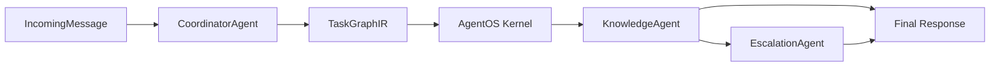

# Hobit AX on AgentOS

## Boundary

AgentOS remains a generic execution layer:

- process and worker lifecycle
- task graph leasing
- conditional DAG execution
- node output schema validation
- capability, policy, approval, trace, and metrics

This application owns Hobit-specific behavior:

- regulation RAG execution
- user/channel normalization
- action plan generation
- human escalation packaging
- future admin console and trigger integrations

## Initial Runtime Flow



## Graph Shape

The first graph is intentionally small:

```text
knowledge_query
  -> escalation_prepare   if requires_human_review == true
  -> final_response       joins completed or skipped branches
```

The existing Supervisor is preserved inside `KnowledgeAgent` first. Later, the same graph can split the knowledge node into intake, intent issue, retrieval, regulation evaluation, and answer composition nodes.

`ActionAgent` is intentionally excluded from the default graph until the Contract Studio document
editing bridge is implemented. The existing stub can be enabled with `HOBIT_ENABLE_ACTION_AGENT=true`
for integration experiments.

## Current Implementation Notes

ActionAgent document editing is intentionally deferred to the Contract Studio integration track.
The non-action agents now have concrete first-pass implementations:

- `ChannelGateway` normalizes API, web, portal, KakaoTalk, and generic payloads.
- `KnowledgeAgent` exposes structured `intent_mode`, `request_type`, `issue_types`, `coverage_report`, profile gaps, and regulation gaps from the existing Supervisor state.
- `PersonaWorker` builds deterministic persona context and predicted questions without an LLM call.
- `PersonaStore` persists persona snapshots in `data/persona_snapshots.jsonl` for session-level reuse.
- `TriggerAgent` emits deadline-window events as `IncomingMessage` objects.
- `DeadlineWatchStore` persists proactive deadline watches and suppresses duplicate daily events.
- `EscalationAgent` persists review cases in `data/escalations.jsonl`.
- `ConversationStore` persists user and assistant turns in `data/conversation_turns.jsonl`, allowing
  PersonaWorker and later agents to share session context.
- `OutboxStore` persists final response delivery records in `data/outbox.jsonl` so channel
  transport can acknowledge `PENDING`, `SENT`, or `FAILED` status independently from response
  generation.
- `DeliveryRenderer` turns outbox records into API, web/portal, KakaoTalk, or generic outbound
  payloads before an external adapter sends them.
- `CoordinationPlanStore` persists the selected/skipped agent set and routing reasons in
  `data/coordination_plans.jsonl`.
- `RunStore` persists AgentOS run summaries and worker result events in `data/agent_runs.jsonl`.
- `AsyncJobStore` persists asynchronous API submissions in `data/async_jobs.jsonl`, linking
  accepted HTTP requests to eventual AgentOS `run_id`, `trace_id`, result, or error details.
- `ServiceRunner` validates every worker output against the declared capability `output_schema`
  before reporting it to AgentOS. Contract violations are recorded as `FAILED` runs with the
  failed node and agent identifiers.
- `ServiceRunner` also validates each leased node against the persisted `CoordinationPlan`.
  Unplanned nodes, agent mismatches, and skipped-agent execution are rejected, while completed
  runs include a `plan_execution` summary for traceability.
- `ServiceRunner` records run/node lifecycle events in `run_summary.lifecycle_events`.
  `/runs/{run_id}/trace` and `run-trace` expose these events as `lifecycle_events` so operators
  can inspect when each node was leased, started, completed, failed, or timed out.
- The core JSONL writers for async jobs, runs, and outbox records use lock files to reduce
  single-machine multiprocess write races. Multi-host deployments should move these stores to a
  database or queue backend.
- `ServiceRunner` records worker exceptions as `FAILED` runs and local deadline misses as
  `TIMED_OUT` runs, preventing orphaned `RUNNING` records when the app-side loop fails.
- Escalation cases can now move from `OPEN` to `ACKNOWLEDGED` and `RESOLVED` through CLI or API.
- Policy reporting now uses the real incoming user/session context when returning worker results to
  AgentOS.
- `ServiceRunner` accepts an injectable kernel client factory, which lets tests exercise the full
  lease/report loop without requiring a live kernel process.
- `ServiceRunner` clears per-run worker results before every request and constructs `EscalationAgent`
  with the active settings, preventing cross-run state leakage and wrong data directories.

## API and CLI Surface

The app exposes operational state instead of hiding everything inside a single query call:

- user portal: `/portal` serves the student-facing experience with chat, TriggerAgent deadline
  notifications, prepared answers from outbox, persona-based suggested questions, and deadline
  watch registration.
- admin UI: `/app` serves the operator console with chat submission, async job polling, session
  timeline, recent runs, and run lifecycle trace inspection.
- local dependency diagnostics and readiness: `/doctor`, `/ready`
- sanitized runtime configuration: `/config`
- optional API token protection: when `AGENTOS_API_TOKEN` is configured, every endpoint
  except `/health` and `/ready` requires `Authorization: Bearer <token>` or `x-api-token`.
- optional in-memory rate limit: when `HOBIT_RATE_LIMIT_PER_MINUTE` is greater than `0`,
  every endpoint except `/health` and `/ready` is limited per token or client IP.
- integration probes: `/integration/probe` checks AgentOS kernel health and real
  `regulation_rag` import/build/query readiness.
- backend smoke test: `/smoke/e2e` checks graph preview, runner execution, run storage, outbox,
  and delivery rendering in one report.
- channel intake: `/gateway/{channel}`, `/gateway/{channel}/dry-run`,
  `/gateway/{channel}/query`
- idempotent execution: `metadata.idempotency_key` or top-level `idempotency_key`
  reuses the existing run result for duplicate requests.
- session history: `/sessions/{session_id}/history`
- session directory: `/sessions` includes async job/run counts and open items
- session summary: `/sessions/{session_id}/summary` includes recent async jobs
- session timeline: `/sessions/{session_id}/timeline` includes `async_job.*` events
- session export and storage stats: `/sessions/{session_id}/export`, `/maintenance/storage`
- async submit jobs: `/query/submit`, `/gateway/{channel}/submit`, `/jobs`,
  `/jobs/{job_id}`, `/jobs/{job_id}/run`, `/jobs/run-queued`,
  `/jobs/requeue-stale`, `/jobs/{job_id}/retry`, `/jobs/{job_id}/cancel`
- async worker loop: `run-jobs --watch` polls durable JSONL jobs for single-machine operation.
  `--requeue-stale-minutes` can recover jobs left in `RUNNING` after worker interruption.
- storage integrity audit: `/maintenance/audit`
- storage retention pruning: `/maintenance/prune`
- operational metrics summary: `/metrics/summary`
- operational alerts: `/alerts`
- agent capability manifest: `/agents`
- session persona: `/sessions/{session_id}/persona`, `/sessions/{session_id}/personas`
- delivery outbox: `/outbox`, `/sessions/{session_id}/outbox`,
  `/outbox/{delivery_id}/sent`, `/outbox/{delivery_id}/failed`
- delivery rendering and dispatch: `/outbox/{delivery_id}/render`,
  `/outbox/{delivery_id}/dispatch`, `/outbox/dispatch`
- coordination plans: `/sessions/{session_id}/plans`
- run queue and traces: `/runs`, `/runs?state=FAILED`, `/sessions/{session_id}/runs`,
  `/runs/{run_id}`, `/runs/{run_id}/trace`
- run retry: `/runs/{run_id}/retry` for failed, timed-out, blocked, or cancelled runs
- run cancel: `/runs/{run_id}/cancel` for pending, running, or blocked runs
- proactive deadline watches: `/triggers/deadline-watches`,
  `/sessions/{session_id}/deadline-watches`, `/triggers/deadline-watches/due`
- proactive dispatch: `/triggers/deadline-watches/due` accepts `dispatch=true` to submit due
  trigger messages into `ServiceRunner`.
- escalation queue: `/escalations`
- escalation status filter: `/escalations?status=OPEN|ACKNOWLEDGED|RESOLVED`
- escalation transitions: `/escalations/{id}/acknowledge`, `/escalations/{id}/assign`,
  `/escalations/{id}/notes`, `/escalations/{id}/resolve`
- proactive deadline event generation: `/triggers/deadline-check`

The matching CLI commands are `doctor`, `integration-probe`, `smoke-e2e`, `config`, `gateway`, `sessions`, `history`, `summary`, `timeline`, `export-session`, `storage-stats`, `storage-audit`, `prune-storage`, `metrics`, `alerts`, `agents`,
`jobs`, `job`, `run-job`, `run-jobs`, `requeue-stale-jobs`, `retry-job`, `cancel-job`, `outbox`,
`mark-delivery-sent`, `mark-delivery-failed`, `render-delivery`, `dispatch-delivery`, `dispatch-outbox`, `plans`, `runs`, `run`, `run-trace`, `retry-run`, `cancel-run`, `escalations`,
`ack-escalation`, `assign-escalation`, `note-escalation`, `resolve-escalation`,
`deadline-trigger`, `watch-deadline`,
`deadline-watches`, `due-deadline-triggers`, `persona`, and `personas`.

`due-deadline-triggers --dispatch` bridges proactive trigger generation into an AgentOS run while
leaving the default command as a preview/emission-only operation.
